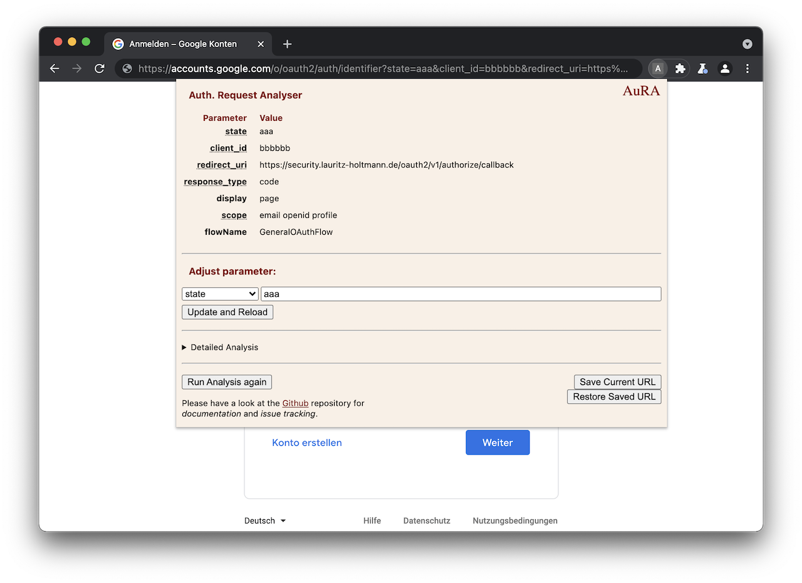

# AuRA - Auth. Request Analyser

This Chromium extensions aims at supporting the analysis of single sign-on implementations, by offering semi-automated analysis and attack capabilities for OAuth 2.0 and OpenID Connect 1.0 [Authorization/Authentication Requests](https://datatracker.ietf.org/doc/html/rfc6749#section-4.1.1).

## Features
* View request parameters at a glance.
  * Hover over standardized parameters for background information about parameters.
* Manually modify request parameters.
* Detailed Analysis of request parameters:
  * *Observations*: Informational findings within the Auth. Request.
  * *Recommendations*: Hardening measures directly identified within the current Auth. Request.
  * *Attacks*: Proposed further test cases, can be automatically executed with one click.
* Store and reload URL: Can be used as clipboard for one valid request, restore saved URL in case an error causes a redirect.
* Manually trigger analysis.

## Installation
For future releases, it is planned to publish the extension at the [Chrome WebStore](https://chrome.google.com/webstore).

Currently, you may either use the latest build published in this repository or directly use the *unpacked sources*.

To use the *unpacked sources*, follow these steps:
1. Clone this repository.
2. Visit chrome://extensions/.
3. Enable *Developer mode* (attention, do not enable this option in your "productive" browser!).
4. Specify the cloned folder.

## Privacy
The extension analyzes the Auth. Request using the bundled *JavaScript* routines. No information is disclosed to the author of this extension. 

## Disclaimer
*Any information shared within this repository must not be used with malicious intentions. This tool is shared for educational purposes only. Any malicious use will not hold the author responsible.*
