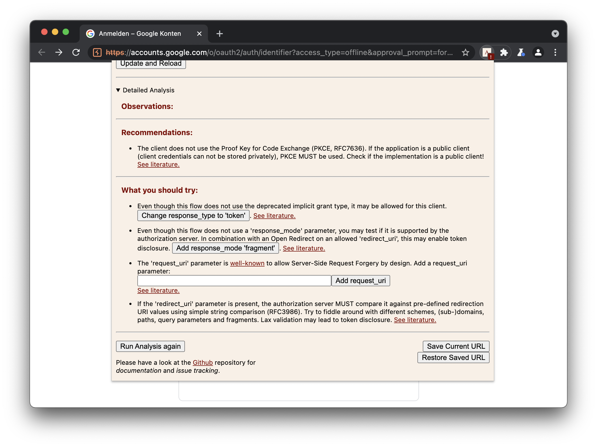

# AuRA - Auth. Request Analyser

This Chromium extensions aims to support the analysis of single sign-on implementations, by offering semi-automated analysis and attack capabilities for OAuth 2.0 and OpenID Connect 1.0 [Authorization/Authentication Requests](https://datatracker.ietf.org/doc/html/rfc6749#section-4.1.1).

## Features
* View request parameters at a glance, either via the *popup* or the *developer tools panel*.
  * Hover over standardized parameters for background information about parameters.
* Manually modify request parameters.
* Detailed Analysis of request parameters:
  * *Observations*: Informational findings within the Auth. Request.
  * *Recommendations*: Hardening measures directly identified within the current Auth. Request.
  * *Attacks*: Proposed further test cases, can be automatically executed with one click.
* Store and reload URL: Can be used as clipboard for one valid request, restore saved URL in case an error causes a redirect.
* Search history for Auth. Request and replay the request.
* Indicate with a batch if the currently visited page appears to be an Auth. Request.
* Manually trigger analysis.

## Installation
*Always keep in mind that browser extensions have broad access to sensitive data! Therefore, it is recommended to install this extension only to browsers that are solely used for security analysis or development purposes. One great example for this is [PortSwigger's Burp Suite embedded browser](https://portswigger.net/burp/documentation/desktop/functions/embedded-browser).*

It is highly recommended to use the latest stable release from [Chrome WebStore](https://chrome.google.com/webstore/detail/clonpaankbndgnciijbiokgjeofjdpeg).

Alternatively, you may either use the latest build published in this repository or directly use the *unpacked sources*. To use the *unpacked sources*, follow these steps (macOS, Linux):
1. Clone this repository.
2. Execute `build.sh` script.
3. Unpack created ZIP archive (`auth-request-analyser_submission_chrome_yy-mm-dd-HH-MM-SS.zip`).
4. Visit chrome://extensions/.
5. Enable *Developer mode* (attention, do not enable this option in your "productive" browser!).
6. Specify the cloned folder.

## Privacy
The extension analyses the Auth. Request using the bundled *JavaScript* routines. No information is disclosed to the author of this extension. 

## Disclaimer
*Any information shared within this repository must not be used with malicious intentions. This tool is shared for educational purposes only. Any malicious use will not hold the author responsible.*
